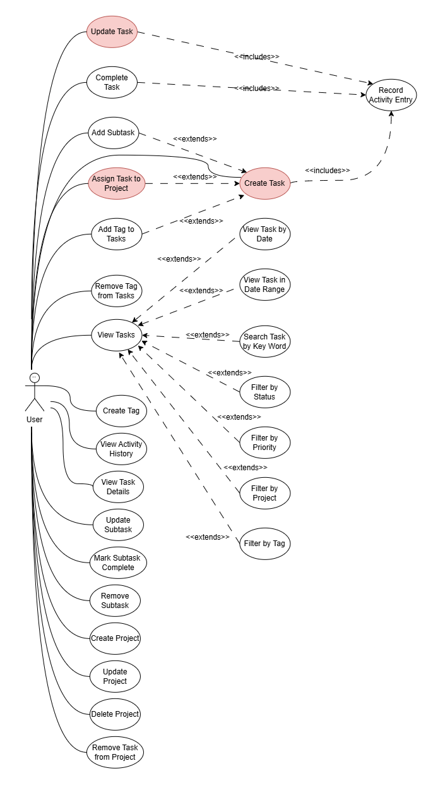
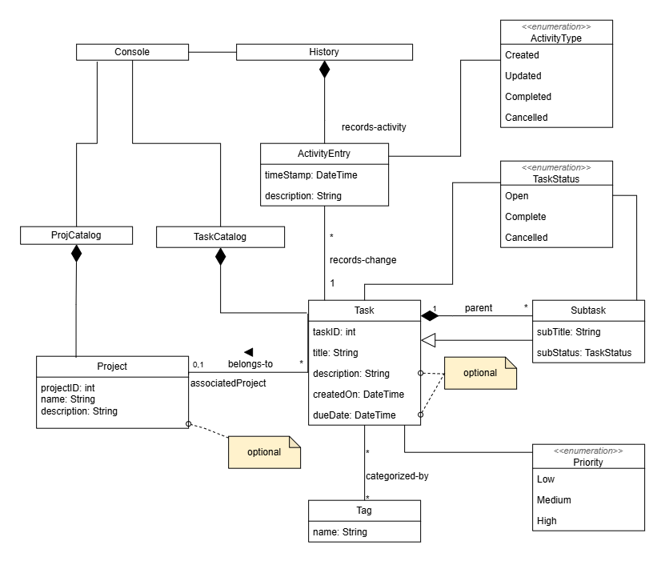
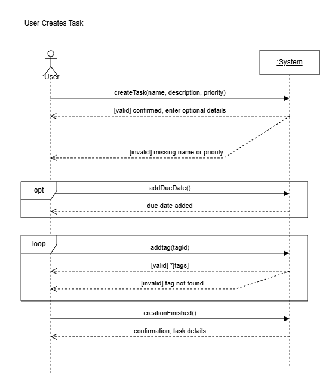
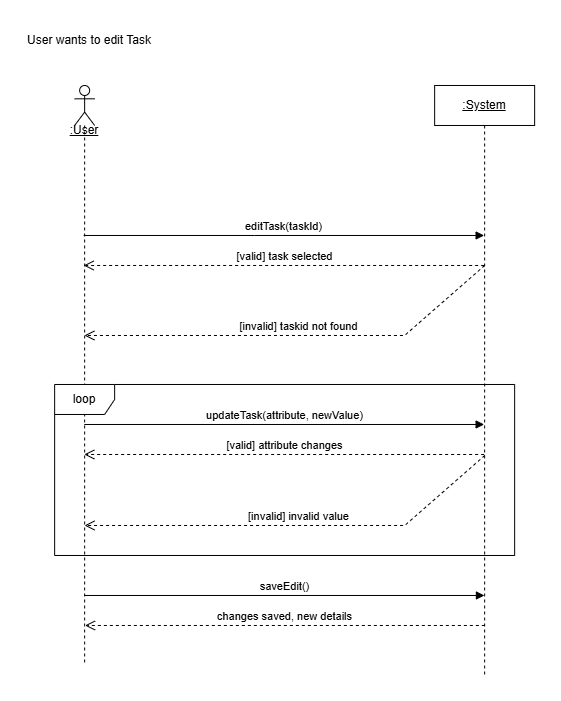
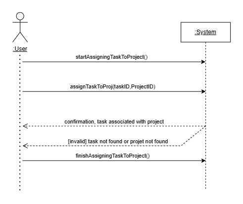
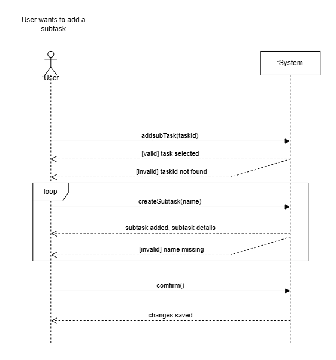
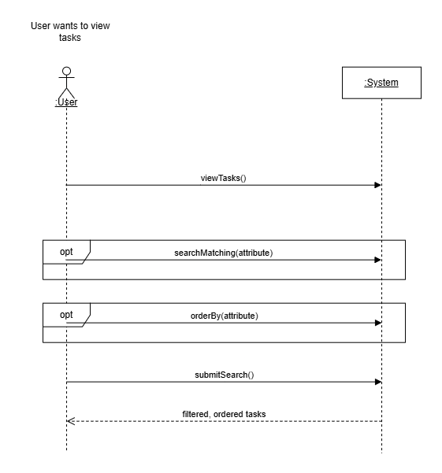

# SOEN 342 — Iteration 1

A clean index of all Iteration 1 deliverables (document + diagrams).

---

## 📌 Quick Links
- [📄 System Operations & Operation Contracts (PDF)](System%20Operations%20%26%20Operation%20Contracts.pdf)
- [🧩 Use Case Diagram](#-use-case-diagram)
- [🧠 Domain Model](#-domain-model)
- [🔁 System Sequence Diagrams (SSDs)](#-system-sequence-diagrams-ssds)

---

## 📄 Document
- **System Operations & Operation Contracts**  
  → [Open PDF](System%20Operations%20%26%20Operation%20Contracts.pdf)

---

## 🧩 Use Case Diagram

  

---

## 🧠 Domain Model

  

---

## 🔁 System Sequence Diagrams (SSDs)

### 1) Task Creation - critical

  

### 2) Edit Task - critical

  

### 3) Assign Task to Project - critical

  

### 4) Add a Subtask

  

### 5) Search Task - critical

  

### 6) Fully Dressed Use Case
#### Use Case UC1 - create task 
#### Primary Actor: User
#### Interests:
- user wants to create a new task, possibly having a description, due date, and tags; 
- The system must store and record tasks and keep track of activity history.

#### Preconditions:
- The user has started the app, and the system is running.

#### Main Success Scenario:
- The user indicates to the system that it wants to create a task
- The user provides a name, a priority, and optionally a description to the system in order to create a task.
- The system creates a task with the provided attributes
- The user can optionally enter a due date; the system will then add the due date to the task
- The user can optionally enter tags for the task
- The system will add the tag to the tasks list of tags.
- The user ends the creation of the task
- The system records the creation activity and displays the new task to the user

#### Extensions:
- If the name or priority is not provided. An error is displayed, and the creation is aborted
- if the due date entered is invalid (ex: in the past), an error is displayed, and the due date is not added to the task.  
- if the tag entered by the user does not exist, an error is displayed

#### Postconditions:
- A new Task is saved in the system
- An ActivityEntry is recorded for the task

---

## 🗂️ Editable Source Files
- Use case + domain model sources:
  - `UseCase.drawio`
  - `DomainModel.drawio`
- SSD sources:
  - `SSD/`
