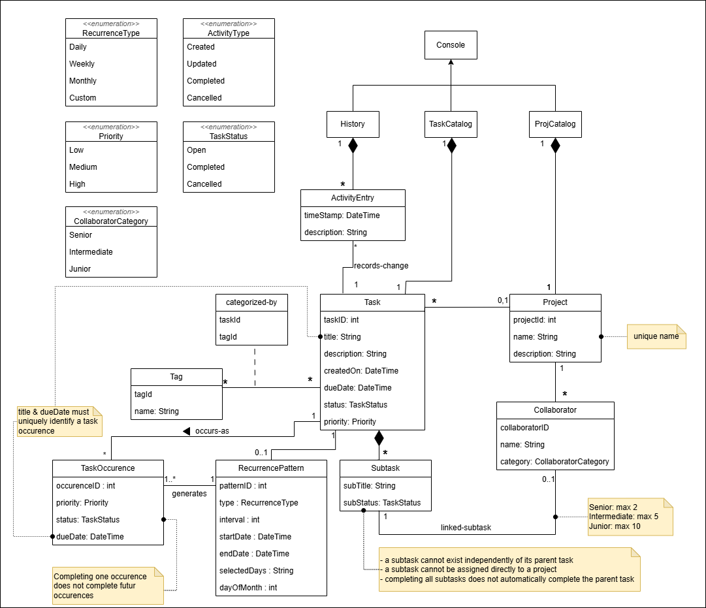
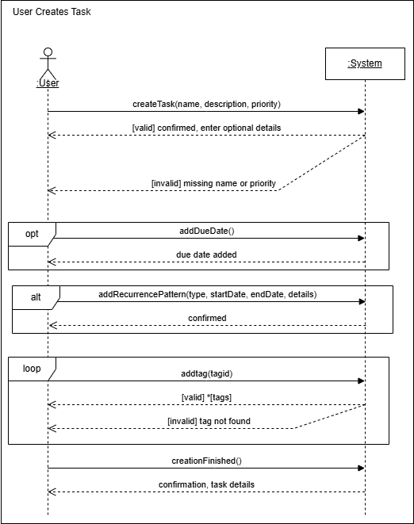
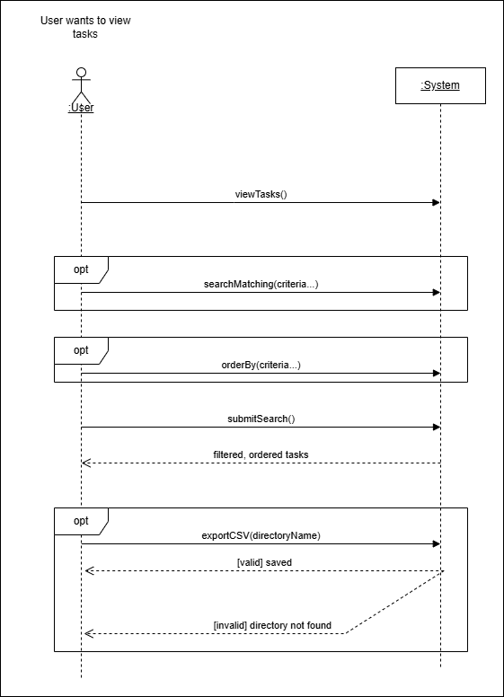
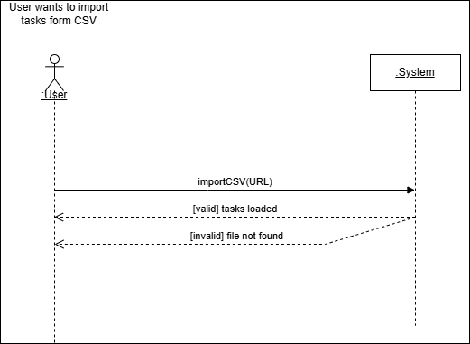
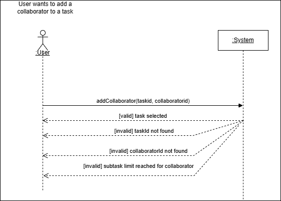
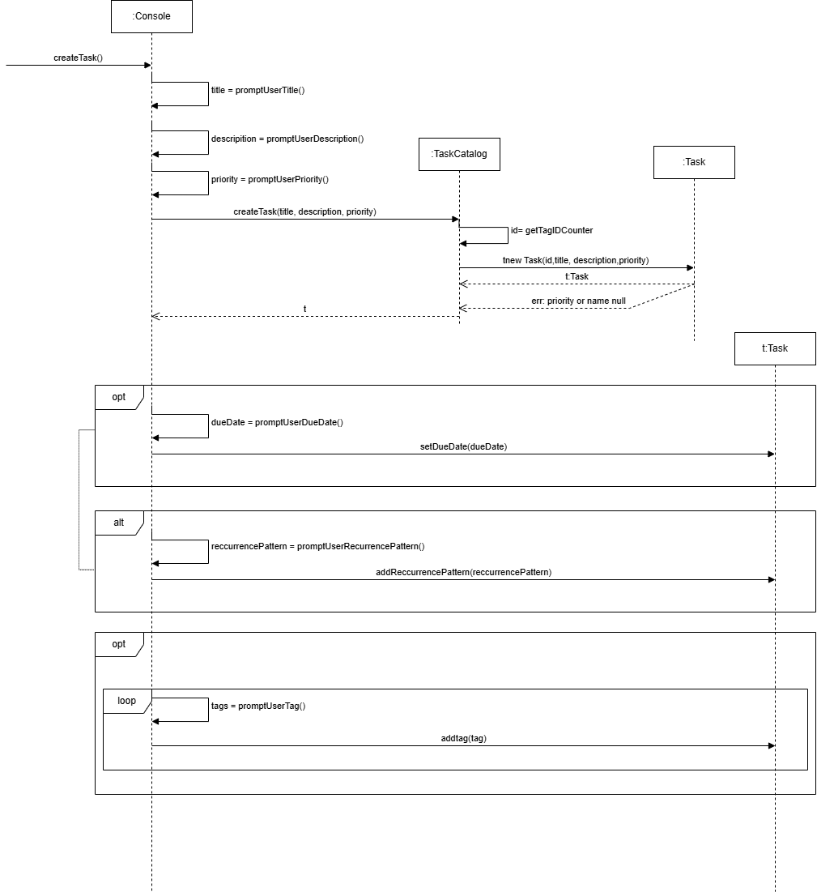
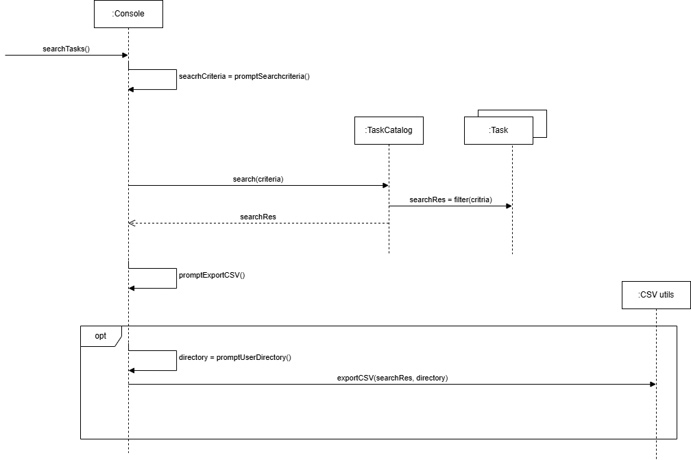
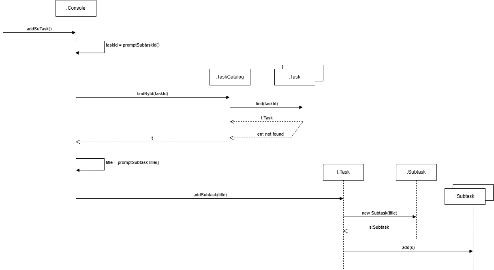
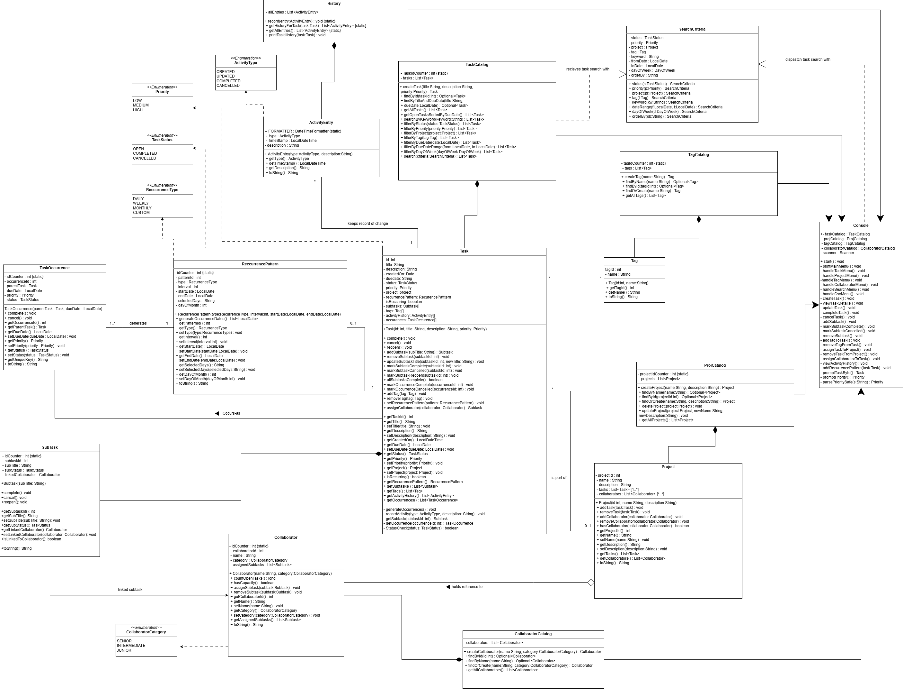

# SOEN 342 — Iteration 2
A clean index of all Iteration 2 deliverables (document + diagrams).
---
## 📌 Quick Links
- [🧩 Use Case Diagram](#-use-case-diagrams)
- [🧠 Domain Model](#-domain-model)
- [🔁 Updated System Sequence Diagrams (SSDs)](#-system-sequence-diagrams-ssds)
- [ Interaction Diagrams ](#interaction-diagrams)
- [🔁 Class Diagram (SSDs)](#class-diagram)
---
## 🧩 Use Case Diagrams

  

  

  

---
## 🧠 Domain Model

  

---
## 🔁 Updated System Sequence Diagrams (SSDs)
### 1) Task Creation - critical

  

### 2) Edit Task - critical

  

### 3) new - Import CSV

  

### 4) new - Link Collaborator

  

## Interaction Diagrams

  

  

  

## Class Diagram

  

## 🗂️ Editable Source Files
- Use case + domain model sources:
  - `UseCase.drawio`
  - `DomainModel.drawio`
- SSD sources:
  - `SSD/`
