# SOEN 342 — Personal Task Management System
### Iteration 4 · Winter 2026

> A Java CLI application for managing tasks, projects, recurring schedules, collaborators, and data import/export — backed by SQLite persistence.

---
## 🔗 Quick Links

- [🎬 Interactive Demo](#-interactive-demo)
- [🚀 Running the Application](#-running-the-application)
- [✨ Features](#-features)
- [🏗 Architecture](#-architecture)
- [📁 Folder Structure](#-folder-structure)
- [📋 Iteration 4 Checklist](#-iteration-4-checklist)
- [Use Case Diagrams](#use-case-diagrams)
- [Domain Model](#domain-model)
- [System Sequence Diagrams](#system-sequence-diagrams)
- [Operation Contracts](#operation-contracts)
- [Interaction Diagrams](#interaction-diagrams)
- [Class Diagram](#class-diagram)
- [Data Model](#data-model)
- [Object Constraints](#object-constraints)
- [State Machine](#state-machine)

---

## 🎬 Interactive Demo

The demo below is a scripted, narrated terminal walkthrough of all ten features.
It runs entirely in the browser — no installation required.

**[▶ Launch Interactive Demo](https://Vaxy15.github.io/SOEN-342-Project/iteration4/demo.html)**

> **To set up the link:** enable GitHub Pages on your repository (Settings → Pages → Branch: `main`, folder: `/` or `/docs`), then replace `YOUR_USERNAME` and `YOUR_REPO` above.  
> Alternatively, open `demo.html` locally — just serve it from the `tts-sync/` folder with `node serve.js` and visit `http://localhost:3000`.

The demo covers all ten sections in order, with skip-ahead pills and 1×/2×/3× playback speed:

| # | Section | What it shows |
|---|---------|---------------|
| 1 | App Startup | Silent DB load, banner, main menu |
| 2 | Tasks | Create tag, create task with priority/due date/tag, view task |
| 3 | Recurring Task | Weekly recurrence, 12 auto-generated occurrences, complete one |
| 4 | Projects | Create project, assign task, verify association |
| 5 | Collaborators | Create JUNIOR and SENIOR collaborators, assign, enforce capacity limit |
| 6 | Overloaded Check | OCL constraint confirmed — system blocks overload at assignment time |
| 7 | Search + CSV Export | Multi-filter search, priority sort, export results to CSV |
| 8 | ICS Export | Export project tasks to `.ics` via Gateway + iCal4J |
| 9 | CSV Import | Import 3 tasks, auto-create missing project/collaborator, verify 7 tasks |
| 10 | Exit + Relaunch | Exit gracefully, relaunch, confirm full persistence via search |

---

## 🚀 Running the Application

### Prerequisites
- Java 17+
- Maven 3.8+
- SQLite (bundled via JDBC — no separate install needed)

### Build
```bash
cd TaskManagerApp
mvn clean package -q
```

### Run
```bash
java -jar target/TaskManagerApp-1.0-SNAPSHOT.jar
```

The database file `app.db` is created automatically in the working directory on first launch.

---

## ✨ Features

### Task Management
- Create tasks with title, description, priority (`LOW` / `MEDIUM` / `HIGH`), and optional due date
- Tag tasks with custom labels; filter by tag in search
- View full task details including subtasks, occurrences, and progress

### Recurring Tasks
- Set `DAILY`, `WEEKLY`, `MONTHLY`, or `CUSTOM` recurrence patterns
- Specify interval, start/end dates, and (for weekly) days of the week
- Occurrences are auto-generated and can be completed independently

### Projects
- Group tasks under named projects with descriptions
- Project membership is enforced for collaborator assignment

### Collaborators & Capacity Control (OCL)
- Collaborators have categories: `JUNIOR` (max 10 open tasks), `INTERMEDIATE` (max 5), `SENIOR` (max 2)
- Assigning a collaborator to a task creates a linked subtask automatically
- The system **blocks** assignment when a collaborator is at capacity — preventing overload rather than detecting it after the fact

### Search & Export
- Filter by keyword, status, priority, project, tag, date range, or day of week
- Sort results by due date, priority, status, or title
- Export any search result set directly to CSV

### ICS Export (Gateway Pattern)
- Export single tasks, all tasks, project tasks, or search results to `.ics`
- Backed by the iCal4J library via the `ExportGateway` abstraction
- Compatible with Google Calendar, Outlook, and Apple Calendar

### CSV Import
- Imports tasks using the same column format produced by export
- Auto-creates missing projects and collaborators silently
- Reports `Imported: N, Skipped: M` summary

### Persistence
- All entities (tasks, subtasks, occurrences, projects, collaborators, tags) are persisted to SQLite via `DBManager`
- Data is loaded silently at startup — no visible loading messages
- Full round-trip verified: exit → relaunch → same state

---

## 🏗 Architecture

```
Main.java
└── Console.java          ← CLI loop (start / handleXxxMenu)
    ├── catalog/
    │   ├── TaskCatalog        (create, search, CRUD)
    │   ├── ProjCatalog        (create, findOrCreate)
    │   ├── TagCatalog
    │   ├── CollaboratorCatalog
    │   └── History
    ├── model/
    │   ├── Task               (toString, subtask/occurrence tracking)
    │   ├── Project
    │   ├── Collaborator       (hasCapacity, countOpenTasks)
    │   ├── Subtask
    │   ├── Tag
    │   ├── RecurrencePattern  (generateOccurrences)
    │   └── TaskOccurrence
    ├── persistence/
    │   ├── DBManager          (init, loadIntoCatalogs, close)
    │   └── DBUtil             (save/load helpers)
    └── util/
        ├── CalendarUtil       (iCal4J VTODO builder)
        ├── CsvUtil            (import / export)
        └── ExportGateway      (Gateway pattern over CalendarUtil)
```

**Key design decisions:**
- The **Gateway pattern** decouples the ICS export logic from iCal4J internals
- **OCL capacity constraints** are enforced in `Collaborator.assignSubtask()` at the model layer, not in the UI
- **Static ID counters** (`Task.idCounter`, `Subtask.idCounter`, etc.) are synced from DB on load via `Math.max`

---

## 📁 Folder Structure

```
iteration4/
├── README.md
├── demo.html                        ← standalone interactive demo (serve locally or via Pages)
├── TaskManagerApp/
│   ├── pom.xml
│   ├── app.db                       ← SQLite database (auto-created)
│   └── src/main/java/
│       └── org/example/
│           ├── Main.java
│           ├── console/Console.java
│           ├── catalog/
│           ├── model/
│           ├── persistence/
│           └── util/
└── tts-sync/                        ← demo tooling (not part of submission)
    ├── demo.html
    ├── generateAudio.js
    ├── serve.js
    └── audio/
        └── nar1.mp3 … nar10.mp3
```

---

## 📋 Iteration 4 Checklist

- [x] Task creation with priority, due date, and tags
- [x] Recurring tasks (DAILY / WEEKLY / MONTHLY / CUSTOM) with per-occurrence completion
- [x] Project grouping and task assignment
- [x] Collaborators with category-based capacity limits (OCL constraint enforced)
- [x] Overloaded collaborator detection (reports empty — constraint prevents it)
- [x] Multi-filter task search with sort and CSV export
- [x] ICS export via Gateway pattern (single / all / project / search)
- [x] CSV import with silent auto-creation of missing entities
- [x] SQLite persistence — full round-trip verified on relaunch

---

## Use Case Diagrams

### Core Tasks Use Case Diagram

<p align="center">
  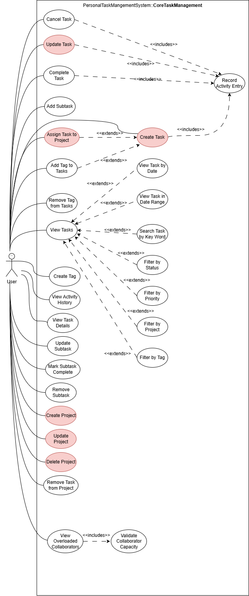
</p>

### Reccurrence pattern and Collaborator assignment Use Case Diagram

<p align="center">
  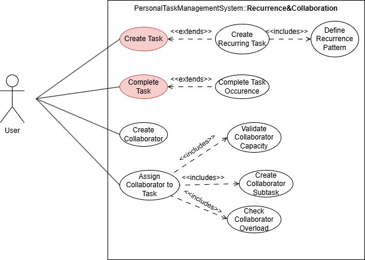
</p>

### CSV and ICS util Use Case Diagram

<p align="center">
  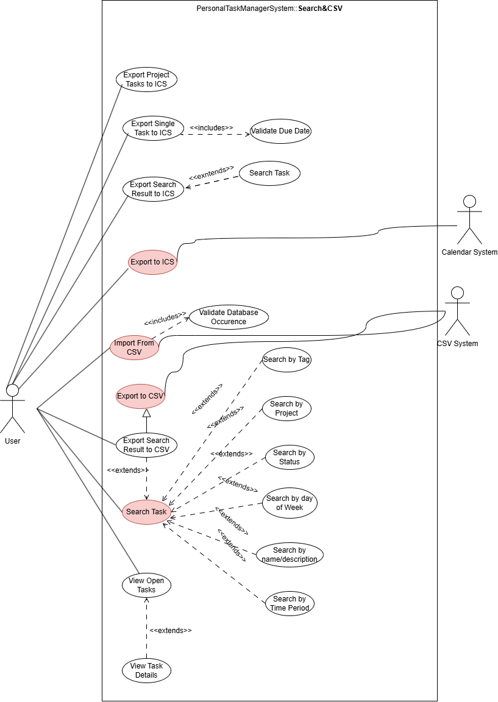
</p>

## Domain Model

<p align="center">
  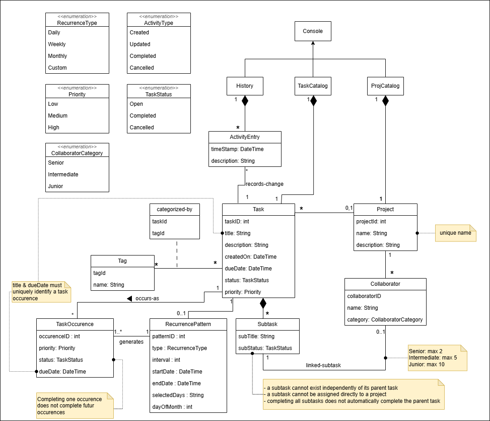
</p>

## System Sequence Diagrams

### Create Task

<p align="center">
  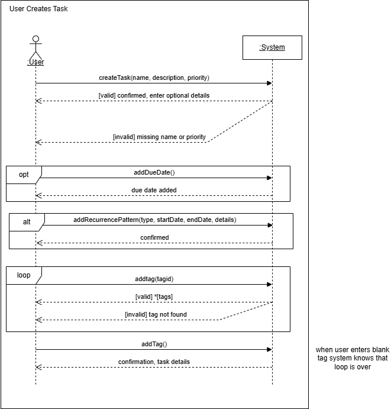
</p>

### Edit Task

<p align="center">
  
</p>

### Add Subtask

<p align="center">
  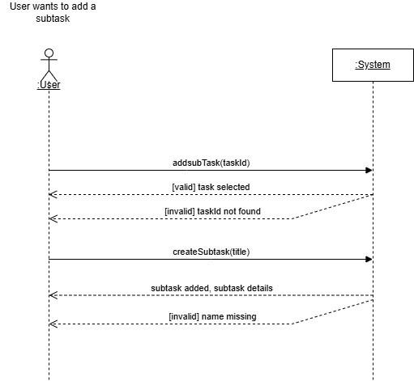
</p>

### Assign Task to Project

<p align="center">
  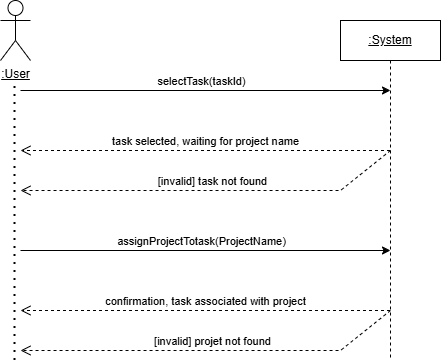
</p>

### Link Collaborator

<p align="center">
  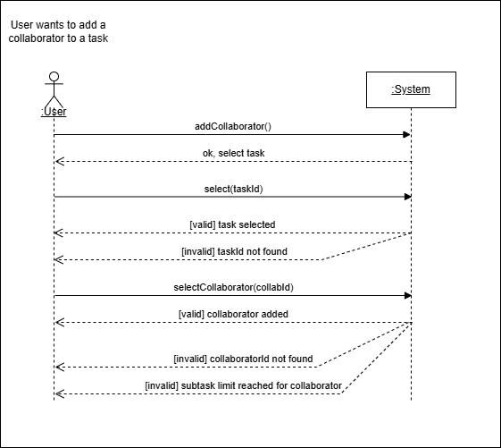
</p>

### Search Task

<p align="center">
  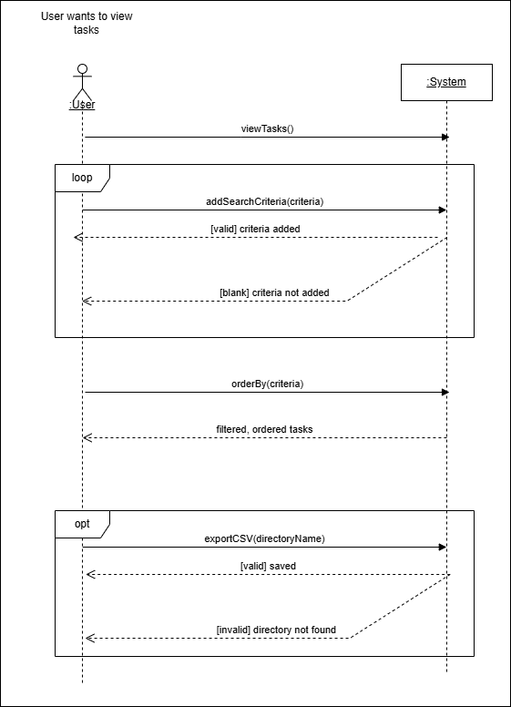
</p>

### Import CSV

<p align="center">
  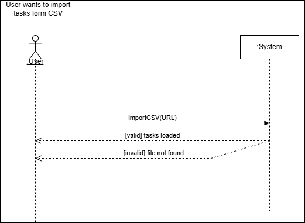
</p>

### Project Creation

<p align="center">
  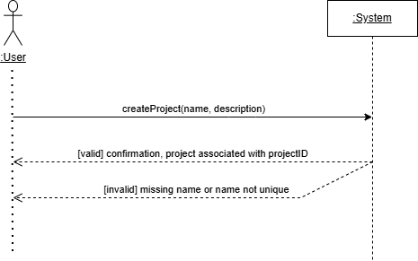
</p>

## Operation Contracts

- **System Operations & Operation Contracts**  
  → [Open PDF](../iteration1/System%20Operations%20%26%20Operation%20Contracts.pdf)

## Interaction Diagrams

### Create Task Sequence Diagram

<p align="center">
  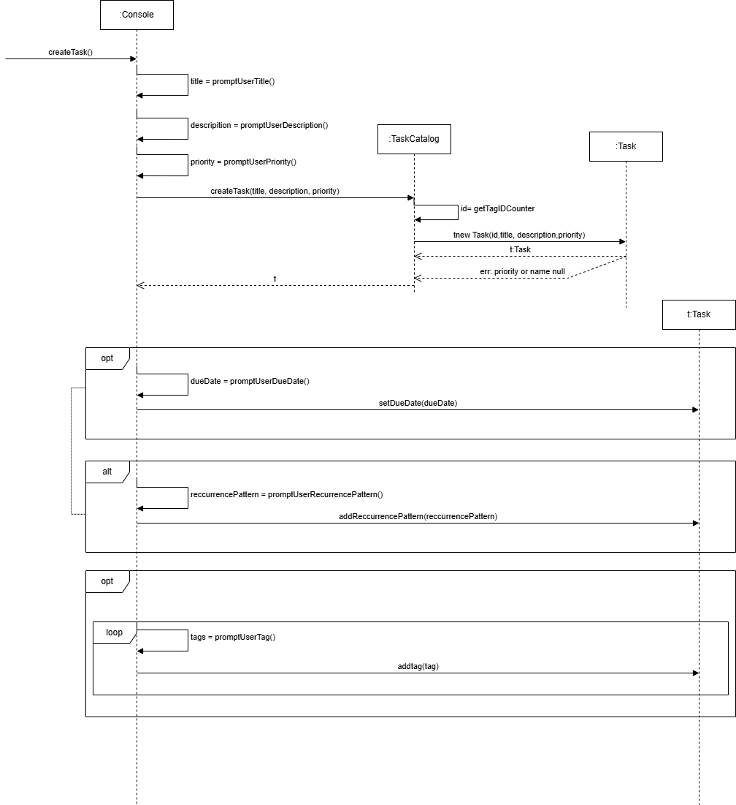
</p>

### Create Subtask Sequence Diagram

<p align="center">
  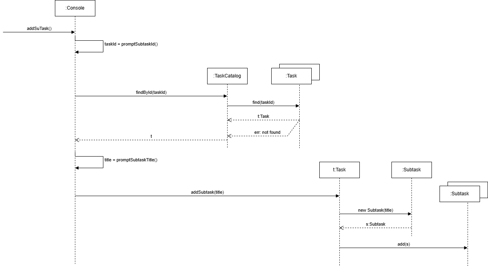
</p>

### Search Task Sequence Diagram

<p align="center">
  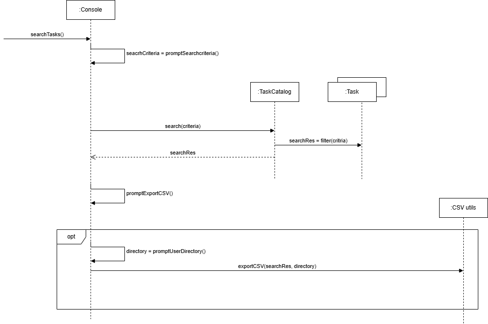
</p>

### Export Sequence Diagram

<p align="center">
  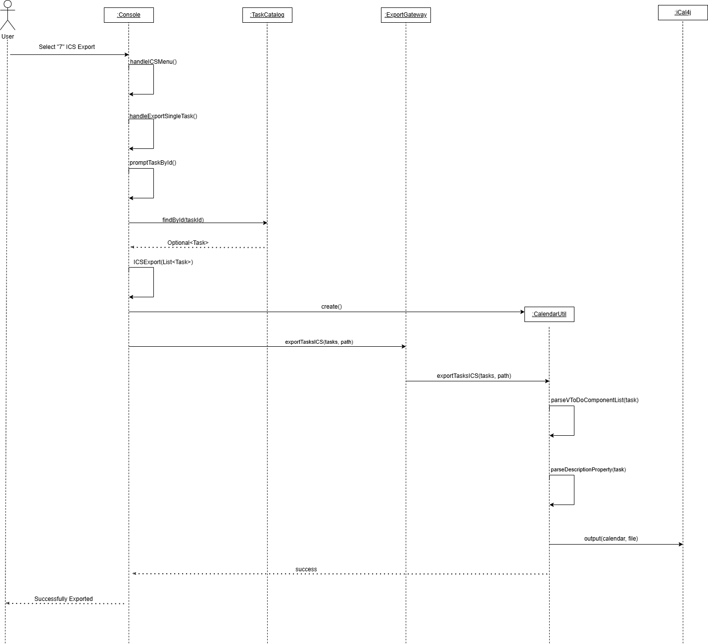
</p>

## Class Diagram

### Core Class Diagram

<p align="center">
  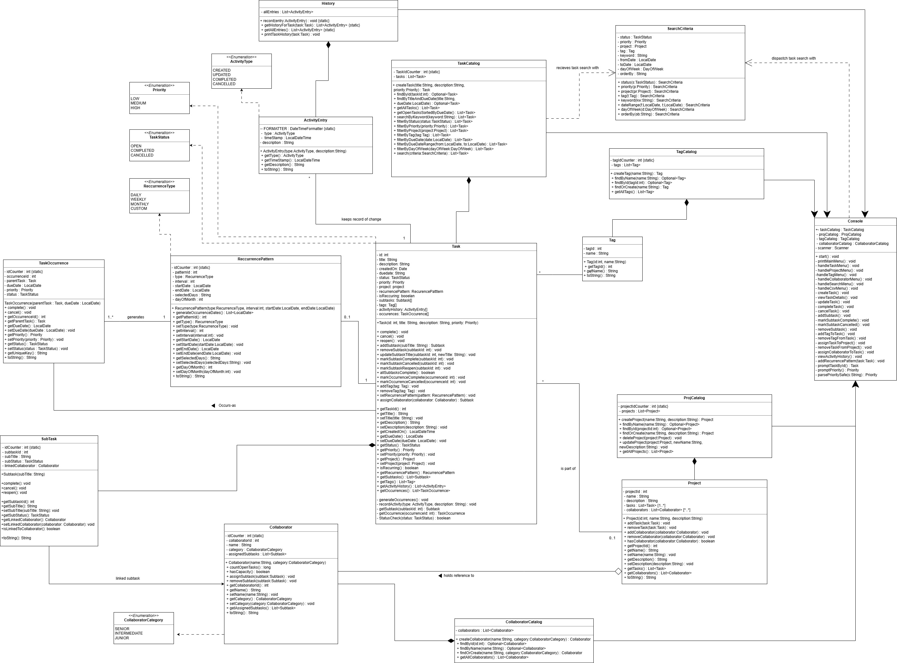
</p>

### Utilities Class Diagram

<p align="center">
  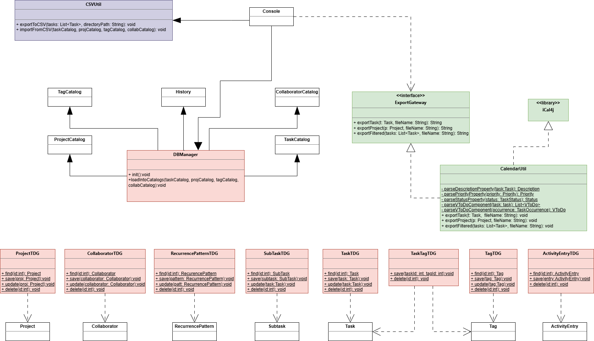
</p>

## Data Model

<p align="center">
  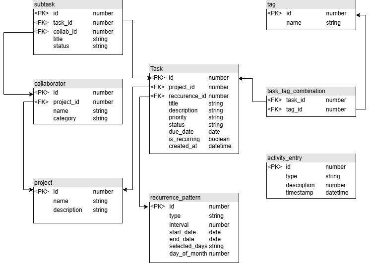
</p>

---

## Object Constraints

## 📦 Object Constraints (OCL)

> ### 🧩 Task — Subtask Limit
> **Constraint:** A task cannot have more than 20 sub-tasks.  
> ```ocl
> context Task
> inv: self.subTasks->size() <= 20
> ```

---

> ### 📅 Task — Open Tasks Without Due Date Limit
> **Constraint:** The number of open tasks without a due date should not exceed 50.  
> ```ocl
> context Task
> inv: Task.allInstances()
>     ->select(t | t.status = TaskStatus::OPEN and t.dueDate.oclIsUndefined())
>     ->size() <= 50
> ```

---

> ### 👤 Collaborator — Capacity Must Be Positive
> **Constraint:** The limit for open tasks for each collaborator category must be a positive integer.  
> ```ocl
> context Collaborator
> inv: self.capacity > 0
> ```

---

> ### 🚫 Collaborator — No Overload
> **Constraint:** No collaborator must be overloaded (assigned open tasks must not exceed capacity).  
> ```ocl
> context Collaborator
> inv: self.assignedTasks
>     ->select(t | t.status = TaskStatus::OPEN)
>     ->size() <= self.capacity
> ```

## State Machine

<p align="center">
  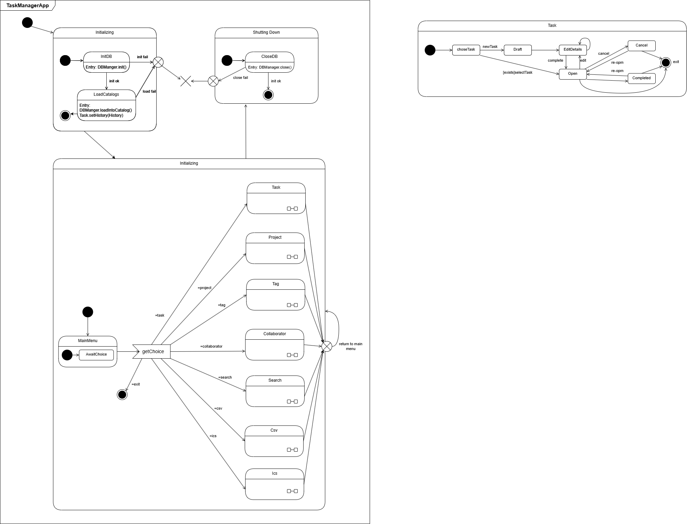
</p>

---
For a better view of the diagrams, navigate to [public folder](public/) to see the raw files.
---

*SOEN 342 — Software Requirements and Specifications · Concordia University · Winter 2026*
